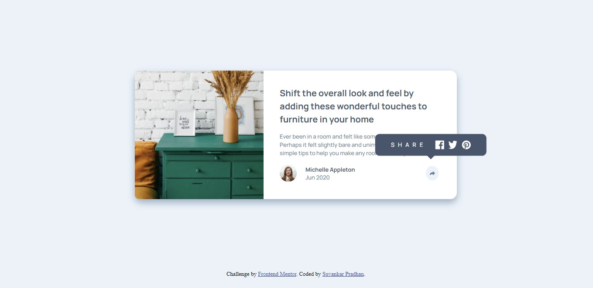

# Frontend Mentor - Article preview component solution

This is a solution to the [Article preview component challenge on Frontend Mentor](https://www.frontendmentor.io/challenges/article-preview-component-dYBN_pYFT). Frontend Mentor challenges help you improve your coding skills by building realistic projects. 

## Table of contents

- [Overview](#overview)
  - [The challenge](#the-challenge)
  - [Screenshot](#screenshot)
  - [Links](#links)
- [My process](#my-process)
  - [Built with](#built-with)
  - [What I learned](#what-i-learned)
- [Author](#author)

## Overview

This is a solution of frontendmentor's challenge. HTML,CSS and Java Script are used to solve this challenge.

### The challenge

Users should be able to:

- View the optimal layout for the component depending on their device's screen size
- See the social media share links when they click the share icon

### Screenshot

### Links

- Solution URL: [Click here](https://github.com/suvankarpradhan/article-preview-component-master)
- Live Site URL: [Click here](https://suvankarpradhan.github.io/article-preview-component-master/)

## My process

First create a html, css, and JS file and link them. In html file I create the structure of article-preview-component-master then add some classes for using css and use JS to make site interactive.

### Built with

- Semantic HTML5 markup
- CSS custom properties
- Flexbox
- Jquery

### What I learned

DOM Manipulation using Jquery.

## Author
- Frontend Mentor - [@suvankarpradhan](https://www.frontendmentor.io/profile/suvankarpradhan)
